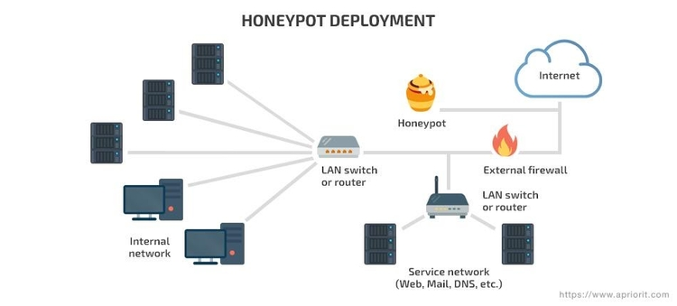
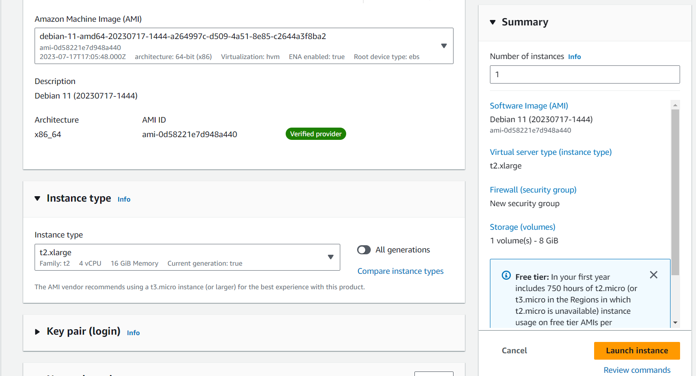
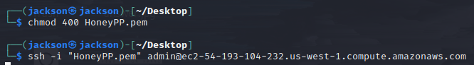
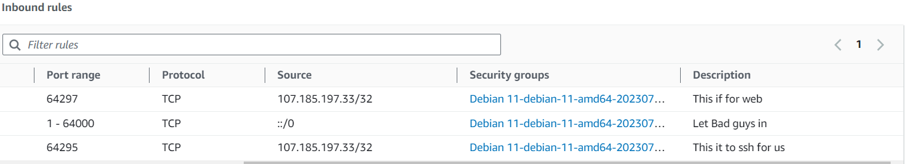
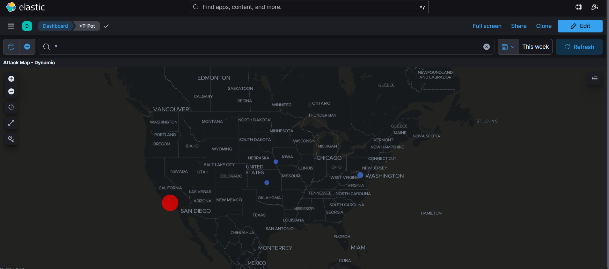
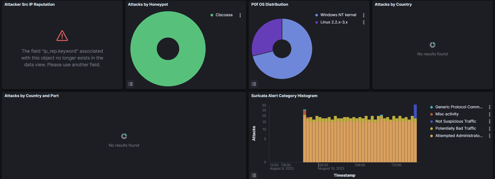

# Honeypot-and-Analysis

 
<h2>Description</h2>
In this project, I designed and implemented a controlled honeypot environment using AWS EC2 instances. The honeypot was strategically configured to mimic vulnerable services, attracting potential attackers. Subsequently, I utilized Kibana, a powerful visualization and analysis tool, to parse and analyze the log information generated by the honeypot, gaining insights into attacker behavior and enhancing overall cybersecurity understanding.
 

<h2>Languages and Utilities Used</h2>

- <b>AWS EC2 Instance (Debian 11)</b>
- <b>T-Mobile CyberAttack Map</b>
- <b>Kibana</b> 

<h2>Environments Used </h2>

- <b>Debian 11</b>
- <b>Windows 11</b> 

<h2>Program walk-through:</h2>

Launch the utility:  

 Create a Honeypot server using AWS EC2 Instance. :   

 
 

 Connect to the Honeypot server and create a pipeline to Deatusche Security:   

 
 

Clone Honeypot repo to our Honeypot EC2 Instance for Kibana use:   

 
 

Configure security groups to allow ports to be shown and accessed for attackers. Allow personal use for SSH and Kibana Dashboard:   

 
 

Analyze attacks from different geographical locations:   

 
 

Anazyle different IDS attack patterns:   

 
 

 
 
